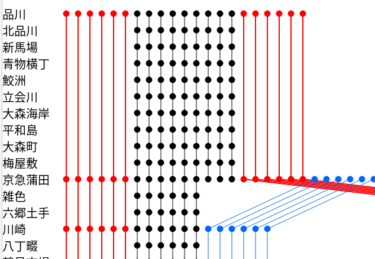

# diagram-svg

日本の鉄道路線のダイヤグラム可視化ツール

**[English README](README.md)**



## 概要

diagram-svg は、JSON データから鉄道ダイヤグラムを SVG 画像として描画するツールです。列車の運行経路・停車パターン・運行本数・種別ごとの速度クラスを可視化します。Google スプレッドシートから CSV を取り込み、JSON に変換する機能も備えています。

## デモ

収録ダイヤグラムの一覧はこちら:

**https://ponkotuy.github.io/diagram-svg/menu.html**

## 機能一覧

- Raphael.js による SVG ダイヤグラム描画
- 種別ごとの色分け表示（普通・快速・急行・特急・新幹線）
- 駅ランクによる階層的な表示（フォントサイズ・色・下線）
- 支線・分岐路線の対応
- Google スプレッドシートからの CSV→JSON 変換
- SVG エクスポート
- 45路線以上を収録したギャラリーページ

## はじめかた

```bash
npm install
npm run build
```

ブラウザで `index.html` を開くとダイヤグラムを表示できます。`menu.html` でギャラリーを閲覧できます。

## 使い方

### ダイヤビューア (`index.html`)

JSON データファイルを読み込み、ダイヤグラムを SVG として描画します。駅名・種別ごとに色分けされた列車線・停車マーカーが表示されます。

### CSV→JSON 変換 (`csv2json.html`)

Google スプレッドシートからエクスポートした CSV データを貼り付けて、ダイヤグラム用 JSON を生成します。駅データ・停車パターン・メタデータ（タイトル・作者・事業者・地域）を解析します。

### ギャラリー (`menu.html`)

Vue.js を使ったギャラリーページで、収録されているすべてのダイヤグラムを一覧表示します。クリックでダイヤグラムを表示します。

## データ形式

ダイヤグラム JSON の構造:

```json
{
  "mainLine": {
    "id": 1,
    "stations": [
      { "id": 1, "name": "駅名", "rank": 1 }
    ],
    "xPos": null
  },
  "subLines": [],
  "trains": [
    {
      "stations": [1, 2, 3],
      "branches": [],
      "speed": 5,
      "count": 10,
      "name": "急行"
    }
  ]
}
```

### 速度クラス（種別マッピング）

| 速度値 | 種別 | 色 | 線幅 |
|--------|------|-----|------|
| 1 | 普通 | 黒 | 1 |
| 2 | 準快速 | 緑 | 1 |
| 3–4 | 快速 | 青 (#0066ff) | 1 |
| 5–6 | 急行 | オレンジ | 2 |
| 7 | 特急 | 赤 | 2 |
| 8 | こだま | 黒 | 2 |
| 9 | ひかり | 青 (#0066ff) | 2 |
| 10 | のぞみ | 濃紺 (#003399) | 2 |

### 駅ランク

| ランク | 色 | フォントサイズ | 下線 |
|--------|-----|--------------|------|
| 1 | 赤 | 22 | あり |
| 2 | 青 | 20 | あり |
| 3 | 黒 | 18 | あり |
| 4以上 | 黒 | 18 | なし |

## 収録路線

`data2/` ディレクトリに 44 路線のダイヤグラムデータを収録:

| 事業者 | 路線 |
|--------|------|
| JR東日本 | 中央線、常磐線、京葉線、総武線 |
| JR西日本 | 福知山線、阪和線、関西本線、片町線、奈良線、嵯峨野線、東海道本線 |
| JR東海 | 中央本線、東海道本線 |
| JR九州 | 鹿児島本線 |
| 京浜急行 | 本線 |
| 京王電鉄 | 本線 |
| 京成電鉄 | 本線 |
| 京阪電鉄 | 本線 |
| 小田急電鉄 | 本線 |
| 東急電鉄 | 田園都市線、東横線 |
| 西武鉄道 | 池袋線、新宿線 |
| 東武鉄道 | 伊勢崎線、東上線 |
| 相鉄 | 本線 |
| 近畿日本鉄道 | 京都線、南大阪線、名古屋線、奈良線、大阪線 |
| 南海電鉄 | 本線、高野線 |
| 阪急電鉄 | 神戸線、京都線、宝塚線 |
| 阪神電鉄 | 本線 |
| 名古屋鉄道 | 知多線、岐阜方面、犬山線、豊橋方面 |
| 西日本鉄道 | 本線 |
| つくばエクスプレス | 本線 |

## 開発

### ビルド

```bash
npm install
npm run build    # webpack で全バンドルをビルド
npm run watch    # ファイル変更時に自動リビルド
```

### Docker ビルド

```bash
docker-compose build
docker-compose run builder
```

### プロジェクト構成

```
src/
├── index.ts          # ダイヤビューア エントリーポイント
├── menu.ts           # ギャラリーページ エントリーポイント
├── csv2json.ts       # CSV変換 エントリーポイント
├── tests.ts          # テストスイート エントリーポイント
├── common/           # データモデル (Line, Station, Train)
├── index/            # 描画エンジン (Drawer, SpeedStyle, StationStyle)
└── csv2json/         # CSVパーサー (FirstParser, diagramAttrs)
data2/                # 路線 JSON データファイル
dist/                 # ビルド済みバンドル（生成物）
```

### テスト

テストは QUnit を使用しています。ビルド後、ブラウザで `test.html` を開いて実行します。

## デプロイ

GitHub Actions により、`master` ブランチへのプッシュごとに GitHub Pages へ自動デプロイされます。ワークフローは Docker でビルドし、`data2/` から `svg_list.json` を生成して `gh-pages` ブランチに公開します。

## ライセンス

ライセンスの詳細はリポジトリを参照してください。
